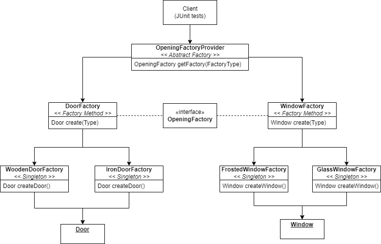

# AbstractFactory Package

This package uses an the **Abstract Factory** (Creation Class pattern) to allow a client (unit tests) to choose a way to
fill an opening (with either a door or a window.) Once the client has chosen what type of opening to fill, the Abstract
Factory returns the corresponding factory with a generically typed interface with a **Factory Method** (Creation Object
pattern) which the client may use to create their object. The Factory Methods are implemented as **Singletons** (
Creation Object pattern) as only a single instance of each class is required.

## Design Diagram

