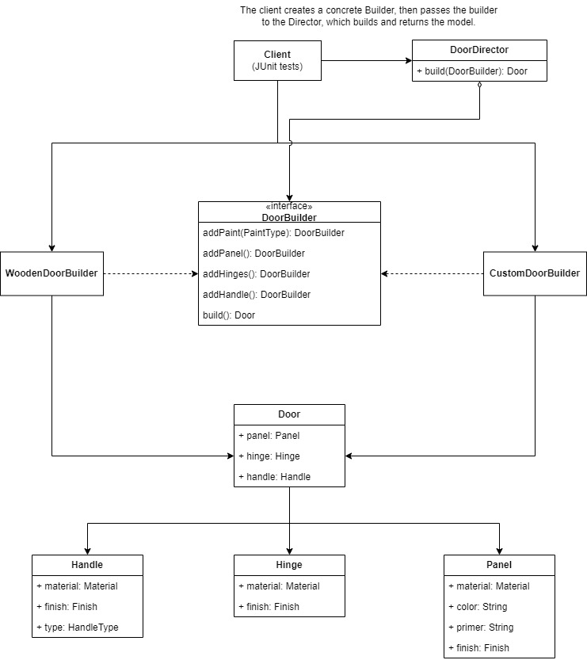

# Builder Package

This package uses a builder + director pattern to create doors. In an enclosed system, the Director
is not needed and adds complexity. The Director allows clients to build objects without knowing about
the underlying pieces. When vending builders within the system, the implementation will likely look 
closer to the CustomDoorBuilder.

## Design Diagram

